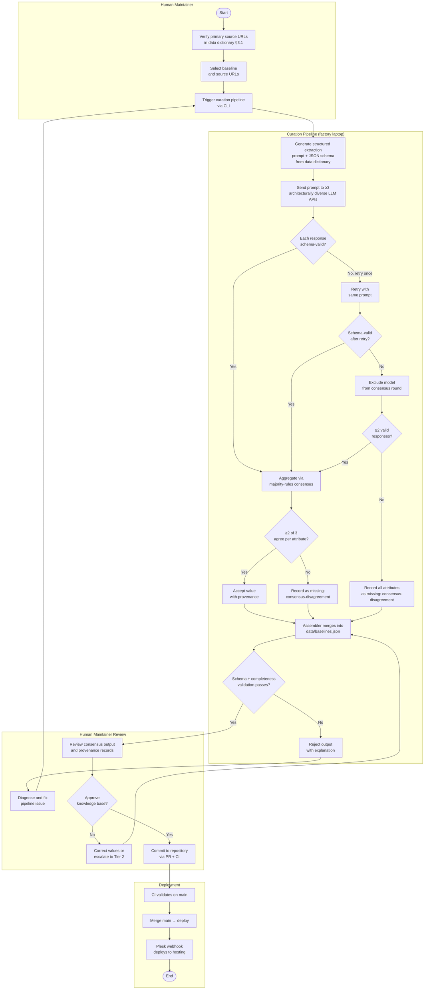
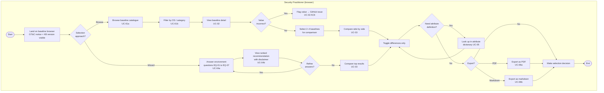

# Functional Design — Baseline Selection Tool (BST)

| Field | Value |
|---|---|
| **Document ID** | FD-BST-001 |
| **Version** | 1.0.0 |
| **Status** | Draft |
| **Author** | Author FD (agent) |
| **Validator** | TBD (assigned at Review FD) |
| **Creation date** | 2026-04-03 |
| **Sign-off date** | Pending |
| **Sign-off authority** | Human Maintainer (Factory Owner) |
| **Factory alignment** | SubscriptionFactory.md v14.0.0 |
| **Principles alignment** | fd-td-design-principles.md v3.4 |
| **Supersedes** | [`functional-design-v1.md`](archive/functional-design-v1.md) (pre-template version, retained for audit trail) |

---

## Table of Contents

1. [Stable Identifiers](#1-stable-identifiers)
2. [Version History](#2-version-history)
3. [Glossary](#3-glossary)
4. [Scope](#4-scope)
5. [Assumptions and Constraints](#5-assumptions-and-constraints)
6. [Risk Cross-Reference](#6-risk-cross-reference)
7. [Cross-Reference](#7-cross-reference)
8. [Change Management](#8-change-management)
9. [Problem Statement](#9-problem-statement)
10. [Compliance and Regulatory Requirements](#10-compliance-and-regulatory-requirements)
11. [Stakeholder Map](#11-stakeholder-map)
12. [Business Process Flows](#12-business-process-flows)
13. [User Stories and Use Cases](#13-user-stories-and-use-cases)
14. [Functional Requirements](#14-functional-requirements)
15. [Reporting and Analytics](#15-reporting-and-analytics)
16. [Quality Requirements](#16-quality-requirements)
17. [UI/UX Design](#17-uiux-design)
18. [Acceptance Criteria and UAT Scope](#18-acceptance-criteria-and-uat-scope)
19. [Design Decisions Log](#19-design-decisions-log)

---

## 1. Stable Identifiers

Every requirement, design element, and use case in this document carries a persistent, unique identifier that does not change across versions. These identifiers anchor the project traceability matrix.

| Prefix | Scope | Example |
|---|---|---|
| `UC-` | User stories and use cases | UC-01a, UC-04b |
| `FR-C` | Curation subsystem functional requirements | FR-C01, FR-C12 |
| `FR-K` | Knowledge store functional requirements | FR-K01, FR-K04 |
| `FR-P` | Presentation subsystem functional requirements | FR-P01, FR-P16 |
| `BC-` | Business constraints | BC-01, BC-11 |
| `EQ-` | Environment profile questions (wizard) | EQ-01, EQ-07 |
| `OFD-` | Open functional decisions (resolved) | OFD-01, OFD-05 |
| `QR-` | Quality requirements | QR-01, QR-07 |
| `RR-` | Risk register entries | RR-01, RR-06 |
| `RA-` | Reporting and analytics requirements | RA-01, RA-05 |

Lifecycle rules per fd-td-design-principles.md v3.4 §Stable identifiers: deleted identifiers are never reused; splits, merges, and material rewrites create new identifiers and deprecate originals with recorded lineage.

---

## 2. Version History

| Date | Version | Change | Author |
|---|---|---|---|
| 2026-04-01 | — | Pre-template functional design (`functional-design-v1.md`) produced | Author FD (agent) |
| 2026-04-03 | 1.0.0 | Restructured to fd-td-design-principles.md v3.4 template. Added: metadata, stable identifiers, version history, glossary, assumptions, risk cross-reference, cross-reference, change management, business process flows, reporting and analytics, quality requirements (separated from NFRs), acceptance criteria and UAT scope, expanded stakeholder map. All existing requirements preserved. | Author FD (agent) |

---

## 3. Glossary

| Term | Definition | Source | First used in |
|---|---|---|---|
| Attribute | A named dimension of comparison across baselines, with definition, data type, objectivity classification, stability, and scoring rubric. The BST defines 45 attributes. | Project-defined | §4 |
| Attribute value | The value of a specific attribute for a specific baseline, accompanied by a provenance record. Absent values are represented explicitly, never as blank or zero. | Project-defined | §4.2 |
| Baseline | A named security hardening specification issued by an authoritative body, described by attributes. Examples: CIS Benchmarks, DISA STIG, ACSC Essential Eight. | NIST SP 800-70 (adapted) | §4 |
| BST | Baseline Selection Tool — the web application specified by this document. | Project-defined | Title |
| Confidence level | An assessed reliability indicator for an attribute value, bounded by the trust tier ceiling. Values: High, Medium, Low. | Project-defined | §14.1.3 |
| Consensus pipeline | The multi-model LLM extraction and majority-rules agreement process used in Tier 2b collection. Minimum 3 architecturally diverse models; 2-of-3 agreement required. | Project-defined | §12.1 |
| Curation pipeline | The automated system that collects, validates, scores, and assembles attribute values from primary sources into the knowledge store. Operates on the factory laptop. | Project-defined | §4.2 |
| Curation subsystem | The subsystem encompassing the curation pipeline and its supporting processes. Synonym of curation pipeline in this document. | Project-defined | §4.1 |
| Data dictionary | The companion document ([`functional-design_-_data-dictionary-v1.md`](functional-design_-_data-dictionary-v1.md)) defining all 45 attributes with stable identifiers, data types, enum values, and scoring rubrics. | Project-defined | §14.1 |
| Disclaimer | A mandatory, structured, non-collapsible text block carried by every recommendation output and every export. Defined in §10.1.2. First-class data entity. | Project-defined | §5.2 |
| Environment profile | The set of answers provided by a user in the selection wizard (UC-04a). Exists only in the browser session; not persisted server-side. | Project-defined | §14.1.1 |
| Export result | A user-generated document (PDF or markdown) from a comparison or recommendation. Scoped to the generating view only — not the full knowledge base. | Project-defined | §14.1.1 |
| Factory Owner | The organisation that develops, operates, and commercialises the BST. Holds IP rights and liability limitation obligations. | SubscriptionFactory.md | §5.2 |
| GT&C | General Terms and Conditions — the Factory Owner's published legal terms governing use of the BST. In preparation at time of writing. | Project-defined | §5.2 |
| Hard filter | A wizard criterion that unconditionally excludes non-matching baselines before scoring. Triggered by OS mismatch (EQ-01) and cost constraint (EQ-04). | Project-defined | §14.5.2 |
| Human Maintainer | The sole operator of the BST in v1: runs the curation pipeline, reviews outputs, deploys updates, and fulfils the Security Practitioner role. | SubscriptionFactory.md | §5.1 |
| Knowledge base | The curated, versioned dataset of attribute values with provenance for all in-scope baselines. Stored as `data/baselines.json`. | Project-defined | §4.1 |
| Knowledge store | The persistence layer for the knowledge base. Provides versioning, staleness tracking, and schema validation. | Project-defined | §4.1 |
| Presentation subsystem | The web application layer that delivers the browser-based comparison and recommendation interface. Deployed to shared hosting. | Project-defined | §4.1 |
| Primary source | An authoritative documentation URL for a baseline, listed in the data dictionary primary source registry (§3.1). The curation pipeline directs LLMs exclusively to these URLs. | Project-defined | §14.2 |
| Provenance record | Source identity, retrieval date, collection method, curator identity, and confidence assessment for every attribute value. | Project-defined | §14.1.1 |
| Recommendation | A ranked list of baselines for a given environment profile, with plain-language reasoning, hard-filter exclusions with reasons, and a mandatory disclaimer. | Project-defined | §14.1.1 |
| Security Practitioner | The end-user role: a person responsible for selecting and implementing a security hardening baseline. In v1, fulfilled by the Human Maintainer. | Project-defined | §11 |
| Staleness | The condition where an attribute value has exceeded its re-verification interval, based on the attribute's stability classification. | Project-defined | §14.1.1 |
| Trust tier | Classification of the collection method that produced an attribute value. Governs the confidence ceiling. Tiers: 1 (machine-extractable), 2 (document-verifiable), 2b (LLM-consensus-extracted), 3 (analyst-scored), 4 (community-aggregated). | Project-defined | §14.1.3 |

---

## 4. Scope

### 4.1 What this document covers

This functional design specifies the Baseline Selection Tool (BST) v1 — a web-based application that helps users select an appropriate security hardening baseline for their workstation environment. It defines what the system must do, for whom, and under which constraints, expressed entirely in functional terms. It does not specify how the system achieves this; those decisions are in the companion architecture document (see §7).

This document is technology-agnostic. It remains valid regardless of which technical scenario the architecture selects.

### 4.2 Subsystem overview

The BST comprises three subsystems:

**Curation subsystem** — Collects, validates, scores, and assembles attribute values via a multi-model LLM consensus pipeline. Calls multiple LLM APIs to extract structured attribute values from publicly accessible baseline documentation, aggregates results via majority-rules consensus, and outputs knowledge store-conformant JSON with full provenance records. Operates on the factory laptop. LLM API calls are the only external dependency. Never runs in the hosted environment.

**Knowledge store** — Persists curated attribute values with full provenance, versioning, and staleness tracking. Single source of truth for the presentation subsystem.

**Presentation subsystem** — Delivers the selection and comparison interface via web browser. Stores no user data as a primary function. Enforces IP and liability protections from §10.1.

### 4.3 Phase scope

This FD covers **phase a** (baseline selection) only. Phase b (guidance integration) and phase c (compliance auditing) are separate future deliverables, explicitly deferred. No architectural decision in v1 may foreclose those phases.

### 4.4 Commercial trajectory

The BST is designed to be commercialised as a SaaS subscription product. IP protection is achieved by delivering the tool as a web service rather than distributable software — clients interact via browser; the knowledge base and selection logic remain server-side. The factory eats its own dog food first.

### 4.5 Bounded architecture slice

This change introduces the BST as a greenfield application. The bounded architecture slice — the authoritative scope constraint for all downstream implementation per [Factory Spec §Agent Model] rule 8 — comprises the entire BST:

| Subsystem | Scope | Location |
|---|---|---|
| Curation Pipeline | All components: Tier 1/2/2b/3 collectors, consensus pipeline, assembler, validator | `src/` (Python) |
| Knowledge Store | Schema, versioned knowledge base, staleness metadata | `data/` |
| Presentation Subsystem | PHP router/gating layer, SPA shell, Alpine.js UI, export logic, rate limiting | `web/` |
| CI/CD and enforcement | Workflows, hooks, linting, type checking, secrets scanning | `.github/`, `hooks/` |

No modules outside this repository are modified by this change. Dependencies on external issues (hosting infrastructure [Infra_-_Subscription_Factory#18], GT&C [Infra_-_Subscription_Factory#17]) are go-live gates, not implementation blockers.

### 4.6 Out of scope — v1

The following are explicitly excluded from v1 and must not be introduced without a governance-change proposal:

- Phase b — integrating selected baseline into `laptop-initiation-guide.md`
- Phase c — compliance auditing against the selected baseline
- Ubuntu 24.04 audit tooling or Linux agent
- Multi-tenant authentication and provisioning
- Per-user forensic GT&C acceptance log (v1 uses IP-based logging; per-user log is v2)
- Real-time data ingestion or live source synchronisation at request time
- AI-generated attribute values or recommendations
- Per-user saved comparisons, profiles, or history
- Reproduction of baseline control content (BST describes and compares baselines; it does not republish CIS control text, STIG rule content, or other copyrighted material)
- Integration with the homemade Windows hardening tool
- CAPTCHA or advanced bot detection beyond robots.txt and rate limiting
- Legal drafting of the GT&C (separate legal task per §10.2)
- GT&C acceptance gating solution (agnostic of individual web applications; managed separately by the Factory Owner)

---

## 5. Assumptions and Constraints

### 5.1 Assumptions

| ID | Assumption | Implication |
|---|---|---|
| A-01 | The Human Maintainer is the sole operator and user in v1. | No multi-user testing, no concurrent access concerns beyond bot deterrence. |
| A-02 | Primary source documentation for in-scope baselines remains freely accessible at the URLs listed in the data dictionary primary source registry. | Staleness detection (FR-C04) covers content changes but not URL availability. URL verification is a manual pre-run step. |
| A-03 | The factory's shared hosting environment supports PHP 8.x and can serve static JSON files via a PHP-gated endpoint. | Hosting capability confirmed (BC-07). If hosting changes, the presentation subsystem deployment model must be reassessed. |
| A-04 | LLM APIs used in the curation pipeline produce sufficiently consistent structured output for majority-rules consensus to yield usable results. | Validated during initial Tier 2b pipeline development. If consensus quality degrades, the Human Maintainer escalates to Tier 2 manual collection. |
| A-05 | The BST's knowledge base is small enough (≤20 baselines × 45 attributes) that all data can be served as a single JSON file without pagination or lazy loading. | Architecture may introduce chunking if the knowledge base grows beyond this assumption. |
| A-06 | Iterative delivery granularity: this FD/TD pair covers the full BST v1 scope as a single unit of delivery. | Per fd-td-design-principles.md §Applicability. |

### 5.2 Business constraints

| ID | Constraint | Source |
|---|---|---|
| BC-01 | Operating expenditure cap: 300 EUR/month total factory spend | [Factory Spec §Operational Constraints #2] |
| BC-02 | Baseline data sources must be freely and publicly accessible; no paid memberships | Factory Owner decision |
| BC-03 | Zero Trust posture applies throughout | [Factory Spec §Security Model (Zero Trust)] |
| BC-04 | The system must not write to managed devices or management systems | [Factory Spec §Operational Constraints #10] |
| BC-05 | No PII is processed by the BST as a primary application function. Infrastructure logging — including GT&C acceptance events — is governed by the Factory Owner's privacy statement §8.2.1 (user action logs, Art. 6(1)(f) AVG, 2-year retention) | [Factory Spec §Explicit Non-Goals]; Factory Owner privacy statement v5.2 |
| BC-06 | All infrastructure must be classifiable under the factory's sovereignty taxonomy | [Factory Spec §Operational Constraints #5] |
| BC-07 | The presentation subsystem must be deployable on the factory's existing shared hosting environment | Q5 decision |
| BC-08 | The curation subsystem must be executable on the factory laptop without external services beyond LLM API calls used by the curation subsystem | [Factory Spec §Operational Constraints #5] |
| BC-09 | All tools and libraries must have clearly understood licensing terms | [Factory Spec §Operational Constraints #4] |
| BC-10 | The knowledge base content, attribute scoring methodology, recommendation logic, and selection rubrics are proprietary intellectual property of the Factory Owner and must be protected against extraction and unauthorised reuse | Factory Owner business requirement |
| BC-11 | The BST is a decision-support tool, not a professional security advisory service. The Factory Owner's liability must be explicitly and consistently limited through mandatory disclaimers, terms of use, and design choices that prevent the tool from being mistaken for professional advice | Factory Owner business requirement |

### 5.3 Multi-tenancy design constraints

The BST is designed to serve multiple independent tenants in its commercial incarnation. A tenant is an organisation with its own subscription, environment profile, and visibility settings over the baseline catalogue.

In v1, only one tenant exists: the factory itself. No tenant management, authentication, or isolation is implemented. The following provisions are design constraints on v1, not v1 features:

- All data structures that will be tenant-scoped must include a tenant identifier field, defaulting to a canonical single-tenant value.
- All interface contracts must accommodate a tenant identifier, even if implicit in v1.
- No v1 decision may require a breaking change when a second tenant is added.
- The GT&C acceptance mechanism must accommodate per-user identity in v2 without structural change. In v1, acceptance is recorded by IP address + timestamp + GT&C version (legally grounded under privacy statement §8.2.1 without per-user authentication). In v2, per-user account strengthens forensic quality to include verified user identity. The v1 log schema must not prevent adding a user identifier field in v2.

---

## 6. Risk Cross-Reference

The BST does not maintain a separate risk register. Per fd-td-design-principles.md §Risk cross-reference, the following risk assessment covers risks to scope, timeline, and quality.

| ID | Risk | Impact | Likelihood | Mitigation | Residual risk |
|---|---|---|---|---|---|
| RR-01 | GT&C not published before target go-live date | Blocks public access; BST remains behind HTTP Basic Auth | Medium | GT&C tracked as [Infra_-_Subscription_Factory#17](https://github.com/quality-factory/Infra_-_Subscription_Factory/issues/17); decoupled from implementation | BST usable internally; public launch delayed |
| RR-02 | LLM consensus quality insufficient for reliable attribute extraction | Knowledge base accuracy degraded; user trust reduced | Low | Multi-model consensus (FR-C08), confidence ceilings (§14.1.3), Human Maintainer review, fallback to Tier 2 manual collection | Some attributes may require manual curation |
| RR-03 | IP extraction via browser developer tools | Proprietary knowledge base content viewable in DevTools | High (technical certainty) | No single action exposes the full KB; exports scoped to current view; GT&C contractual prohibition | Accepted: protection goal is bulk extraction prevention, not cryptographic inaccessibility (OFD-05) |
| RR-04 | Primary source documentation URLs become unavailable or relocate | Curation pipeline produces stale or missing values | Medium | URL verification before each run; staleness detection (FR-C04); primary source registry in data dictionary §3.1 | Manual URL updates required; short-term staleness possible |
| RR-05 | Single-operator dependency (bus factor = 1) | All curation, deployment, and maintenance depend on one person | High | Comprehensive documentation (operations.md); deterministic pipeline; knowledge base versioning enables reconstruction | Operational risk accepted for v1 single-tenant phase |
| RR-06 | Hosting environment changes or becomes unavailable | Presentation subsystem deployment disrupted | Low | Sovereignty taxonomy classification (BC-06); exit strategy documented in Cost Register | Redeployment to alternative hosting required |

---

## 7. Cross-Reference

| Document | ID | Version | Relationship |
|---|---|---|---|
| Technical Design — BST | TD-BST-001 (`docs/architecture.md`) | TBD (not yet formalised under template) | Paired TD for this FD. The TD defines how the system achieves the requirements specified here. |
| Operations Guide — BST | — (`docs/operations.md`) | TBD | Deployment pipeline, verification, operational notes. |
| Data Dictionary — BST | — (`docs/functional-design_-_data-dictionary-v1.md`) | 1.0 | Companion to this FD. Defines all 45 attributes. Authoritative source for attribute definitions referenced in §14.1. |
| Factory Specification | — (`Infra_-_Subscription_Factory/SubscriptionFactory.md`) | v14.0.0 | Governing factory policies. Business constraints (§5.2) trace to this document. |
| Project traceability matrix | — | TBD | To be established when this FD enters In Review. Links business objectives → FD requirements → TD design elements → test cases. |

Cross-references will be updated with formal document IDs and version numbers when both FD and TD are formalised, per fd-td-design-principles.md §Cross-reference.

---

## 8. Change Management

### 8.1 Baselining mechanics

This document is baselined when its status transitions to **Formalised** following Human Maintainer sign-off. The permitted state transitions are defined in fd-td-design-principles.md §Metadata.

### 8.2 Sign-off authority

The Human Maintainer (Factory Owner) holds non-delegable sign-off authority for this FD. This satisfies the project approval matrix requirement for business outcomes, security and privacy, and quality assurance coverage. Technical architecture sign-off authority applies to the TD.

### 8.3 Change-vs-clarification heuristic

Per fd-td-design-principles.md §Change management: any modification that alters acceptance criteria, scope boundaries, traceable requirements (FR-xx, UC-xx, BC-xx, QR-xx), sign-off conditions, stable identifiers, or the meaning of any specification is a **change** requiring re-review. Typographical corrections, grammatical fixes, and formatting adjustments that do not alter meaning are **clarifications**. Administrative updates to cross-references are a distinct category with their own lighter process. In cases of doubt, the modification is treated as a change.

### 8.4 Post-formalisation changes

Any change to this document after formalisation requires:

1. The change is recorded in §2 (Version History) with rationale.
2. The validator reviews the change.
3. The sign-off authority approves the change.
4. The document version is incremented.
5. The TD cross-reference is updated if the change affects the TD's scope.

---

## 9. Problem Statement

### 9.1 Problem

Security hardening baselines are numerous, structurally different, and poorly compared in publicly available resources. Practitioners currently choose baselines by familiarity or mandate rather than by systematic fit with their environment. The BST makes this choice systematic, transparent, and auditable — first for the factory's own workstation hardening, then as a commercial SaaS product.

### 9.2 Immediate use case

The factory's own Ubuntu 24.04 LTS workstation baseline was chosen opportunistically without research. The BST is first applied to re-evaluate that choice systematically, then the result is integrated into the laptop initiation guide with the selected baseline properly justified.

### 9.3 Scope of protection and accepted risk

The BST is a commercially developed and maintained tool representing a significant investment of time and expertise. This document governs two categories of business risk as first-class design requirements: intellectual property extraction and legal liability. See §10.1.

---

## 10. Compliance and Regulatory Requirements

### 10.1 Usage governance policy

#### 10.1.1 Intellectual property

The DevOps investment required to develop, curate, and maintain the BST represents a significant commercial asset. This asset must be protected by design.

**What is protected:** The complete knowledge base, scoring rubrics, recommendation methodology, and comparative analysis approach. These are proprietary even where underlying source data is publicly derivable, because their curation, validation, organisation, and contextualisation represent the Factory Owner's intellectual work.

**Protection requirements:**

1. The knowledge base must not be exposed as a directly accessible or bulk-downloadable resource. Users access results of queries — not the knowledge base itself.
2. No single user action may retrieve the complete dataset in a single operation.
3. Exports (UC-06a, UC-06b) are scoped to the comparison or recommendation result only — not the underlying knowledge base. Exports carry attribution identifying the Factory Owner as the source.
4. Automated access by bots, scrapers, crawlers, or AI agents must be technically deterred and contractually prohibited.
5. The GT&C must prohibit: systematic data extraction, use of tool outputs to train machine learning models, reproduction of tool content without attribution, and commercial use of extracted data.

**GT&C status:** The GT&C is currently in preparation. This is an accepted risk (RR-01) contingent on the BST remaining non-public until the GT&C is published. HTTP Basic Auth on the BST URL is the interim access control. See §4.6 (go-live gate) and §10.2.

#### 10.1.2 Limitation of liability

The Factory Owner operates exclusively B2B. Dutch commercial law (Boek 6 BW) applies to the contracting relationship. EU consumer protection law does not apply to the primary client base.

**Liability limitation requirements:**

1. Every recommendation output must carry a mandatory, prominent disclaimer — an integral, non-collapsible part of the result — stating:
   - The BST is a decision-support tool, not a professional security advisory service.
   - The recommendation is generated from a knowledge base that may contain inaccuracies, omissions, or outdated information.
   - The knowledge base version and generation date are shown; the user must assess currency.
   - The recommendation is based solely on the environment profile provided; other factors are not considered.
   - The user is solely responsible for independent validation before implementation.
   - The Factory Owner accepts no liability for security outcomes resulting from reliance on BST recommendations.

2. The disclaimer must be integral and non-collapsible. It must appear as part of the recommendation output, never as a dismissible modal.

3. The GT&C must be displayed before access to tool outputs. In v1, a cookie-based agreement popup at the website layer provides acceptance recording (implemented by the webmaster). The BST application logs acceptance events server-side per FR-P16.

4. The tool must never use language implying certainty, guarantee, or endorsement.

5. Every data point displayed must show its source and access date.

#### 10.1.3 Agentic access policy

1. The tool must publish a robots.txt prohibiting access by known AI crawler and scraper user agents.
2. The server must implement rate limiting constraining requests per IP address, regardless of user agent.
3. The GT&C must explicitly prohibit automated access, crawling, scraping, and feeding BST output into AI training pipelines.
4. The BST must not expose any programmatic API enabling automated bulk extraction of knowledge base content.

### 10.2 Legal and compliance requirements

- GT&C preparation status and accepted risk: see §10.1.1. Go-live gate: see §4.6. Tracked as [Infra_-_Subscription_Factory#17](https://github.com/quality-factory/Infra_-_Subscription_Factory/issues/17).
- Before go-live, the GT&C liability limitation clause must be reviewed for compliance with Dutch commercial law (Boek 6 BW) — specifically: reasonableness of the limitation (Art. 6:248 BW), and whether intentional acts or gross negligence carve-outs are required. EU consumer protection law (Directive 93/13/EEC) does not apply to the B2B-only client base.
- GT&C version must be tracked. Changes to the GT&C that affect user rights trigger a new acceptance event requirement.
- The disclaimer text (§10.1.2) must be reviewed for legal adequacy before go-live. It is not a substitute for the GT&C.

### 10.3 AI Act (Regulation (EU) 2024/1689) compliance assessment

The BST uses general-purpose AI models (LLMs) in its offline curation pipeline (Tier 2b). This section assesses regulatory obligations under the AI Act.

**Classification of the BST's recommendation engine:**

The recommendation engine is a deterministic, rule-based weighted scoring system: same knowledge base version + same environment profile answers = same ranked output (§14.5). It does not infer, adapt, or exhibit autonomy. It does not meet the Article 3(1) definition of an "AI system." The engine is therefore outside the AI Act's scope as a system being placed on the market.

**Classification of the curation pipeline's use of LLMs:**

The Factory Owner is a **deployer** (Art. 3(4)) of general-purpose AI models used to extract structured attribute values from public documentation. The LLM providers are **providers** of general-purpose AI models. The curation pipeline operates offline on the factory laptop and does not interact with end users.

**High-risk assessment (Art. 6, Annex III):**

The BST does not fall into any Annex III high-risk category. It does not perform biometric identification, operate critical infrastructure, evaluate natural persons for education/employment/benefits/credit, assist law enforcement, or influence elections. Even if Annex III were applicable, the Art. 6(3) exemptions would apply: the BST performs a narrow procedural task (baseline comparison) and improves the result of a previously completed human activity (baseline selection). No profiling of natural persons occurs.

**Transparency obligations (Art. 50):**

| Obligation | Trigger | BST assessment |
|---|---|---|
| Art. 50(1): Inform users of AI interaction | AI system intended to interact directly with natural persons | Does not apply — the recommendation engine is rule-based, not AI. Users interact with a deterministic scoring system. |
| Art. 50(2): Mark AI-generated content as machine-readable | AI systems generating synthetic text/content | Borderline — LLM-extracted attribute values could be considered AI-generated content. However, the values are factual extractions from primary sources, consensus-filtered, and human-reviewed — not synthetic content. |

**Existing transparency measures (conservative compliance):**

Regardless of whether Art. 50(2) strictly applies, the BST already provides transparency exceeding the regulation's intent:
- Every attribute value displays its trust tier; Tier 2b is explicitly labelled as LLM-consensus-extracted (FR-P03).
- Full provenance records include model identifiers, prompt versions, and individual model outputs (FR-C06, FR-C08(f)).
- The disclaimer states that the knowledge base may contain inaccuracies (§10.1.2).
- Confidence ceilings are enforced: LLM-extracted values cannot exceed Medium confidence (§14.1.3).

**AI literacy (Art. 4):**

The Factory Owner, as deployer of LLM models, must ensure sufficient AI literacy of staff operating the curation pipeline. This is satisfied by the single-operator model (BC-08, FR-C07): the Human Maintainer operates the pipeline, reviews consensus outputs, and makes acceptance decisions. The curation pipeline's provenance records and degradation rules (FR-C08(e)) support informed oversight.

**Summary:**

| Requirement | Status | Mechanism |
|---|---|---|
| Not high-risk (Annex III) | Confirmed | No applicable category |
| Recommendation engine not an AI system | Confirmed | Deterministic rule-based scoring (§14.5) |
| Deployer obligations for LLM use | Applicable | Single-operator model with full provenance |
| Art. 50 transparency | Exceeded voluntarily | Trust tier display, provenance records, confidence ceilings |
| Art. 4 AI literacy | Satisfied | Human Maintainer as sole pipeline operator |

### 10.4 Security posture

This section consolidates the security requirements for the BST as a business-facing summary. It documents what the business requires to be protected, framed for business stakeholder review. Technical threat modelling and enforcement mechanisms are deferred to the architecture phase.

#### 10.4.1 Data classification

| Data category | Classification | Rationale |
|---|---|---|
| Knowledge base (attribute values, scoring rubrics, recommendation methodology) | **Proprietary / Commercial-in-confidence** | Represents the Factory Owner's curated intellectual work (BC-10). Protection by design required. |
| Attribute provenance records | **Internal** | Source citations to public documents; value is in the curation, not the sources themselves. |
| GT&C acceptance log (IP address, timestamp, GT&C version, user agent hash) | **Personal data (Art. 4(1) AVG)** | IP address is personal data under GDPR/AVG. Processing governed by privacy statement §8.2.1, Art. 6(1)(f) AVG. 2-year retention. |
| Environment profile answers (wizard inputs) | **Transient / Not stored** | Exists only in browser session memory (FR-P02). No server-side persistence. |
| Disclaimer text | **Public** | Intentionally displayed to all users. |
| Curation pipeline intermediate files | **Internal** | Staging-directory outputs; not deployed. Contain LLM extraction results with provenance. |

#### 10.4.2 Compliance constraints

| Constraint | Source | Implication |
|---|---|---|
| Dutch commercial law (Boek 6 BW) | §10.2 | Liability limitation clause must be reviewed for reasonableness (Art. 6:248 BW). Intentional acts / gross negligence carve-outs may be required. |
| AVG/GDPR Art. 6(1)(f) | Privacy statement §8.2.1 | GT&C acceptance log processing requires legitimate interest basis. 2-year retention. Erasure via "beyond use" marking. |
| EU consumer protection (Directive 93/13/EEC) | §10.1.2 | Does not apply — B2B-only client base. |
| BC-09 licensing | §5.2 | All tools and libraries must have clearly understood licensing terms. |
| Sovereignty taxonomy | BC-06, QR-06 | All infrastructure classified before deployment; exit strategies documented for class (b) components. |
| AI Act (Reg. (EU) 2024/1689) | §10.3 | BST not high-risk; recommendation engine not an AI system; deployer obligations for LLM use in curation pipeline satisfied. See §10.3 for full assessment. |

#### 10.4.3 Access control requirements

| Control | Requirement | Source |
|---|---|---|
| GT&C acceptance gate | GT&C displayed and accepted before access to tool outputs | FR-P10, §10.1.2 |
| Interim access control | HTTP Basic Auth while GT&C is in preparation | §10.1.1, §4.6 go-live gate |
| Rate limiting | Server-side per-IP rate limiting on all content requests | FR-P12, §10.1.3 |
| Bot deterrence | robots.txt prohibiting known AI crawlers; bot user-agent rejection at PHP layer | FR-P13, §10.1.3 |
| Knowledge base gating | KB served only via PHP endpoint; direct file access blocked | FR-P09, BC-10 |
| No application-level auth in v1 | No accounts, sessions, or per-user identity | FR-P02, §11, §5.3 |
| v2 provision | Log schema accommodates per-user identity field addition without structural change | §5.3 |

#### 10.4.4 Trust boundaries

```
┌─────────────────────────────────────────────────────────────┐
│  TRUST BOUNDARY 1: Factory laptop (sovereign)                │
│  ┌───────────────────────────────────────────────────────┐  │
│  │  Curation pipeline                                     │  │
│  │  - LLM API calls cross this boundary (outbound)        │  │
│  │  - LLM responses are untrusted input                   │  │
│  │  - Primary source URLs are allowlisted (FR-C10)        │  │
│  │  - Schema validation before write (FR-C05)             │  │
│  └───────────────────────────────────────────────────────┘  │
│                      │ committed via PR + CI                 │
└──────────────────────┼──────────────────────────────────────┘
                       │
┌──────────────────────▼──────────────────────────────────────┐
│  TRUST BOUNDARY 2: Shared hosting (semi-trusted)             │
│  ┌───────────────────────────────────────────────────────┐  │
│  │  PHP layer (enforces rate limiting, headers, gating)    │  │
│  │  - All inbound HTTP requests are untrusted              │  │
│  │  - KB served read-only; no write path from web          │  │
│  │  - Acceptance log is write-once                         │  │
│  └───────────────────────────────────────────────────────┘  │
└──────────────────────┬──────────────────────────────────────┘
                       │ HTTPS
┌──────────────────────▼──────────────────────────────────────┐
│  TRUST BOUNDARY 3: Browser (untrusted)                       │
│  - Environment profile answers remain client-side only       │
│  - All recommendation logic executes client-side             │
│  - KB content visible in browser devtools (accepted          │
│    residual risk; protection goal is bulk extraction          │
│    prevention, not cryptographic inaccessibility)             │
└─────────────────────────────────────────────────────────────┘
```

#### 10.4.5 Cross-boundary data flows

| # | Flow | Trust level | Controls |
|---|---|---|---|
| 1 | LLM API → Curation pipeline | Untrusted | Schema-validated and consensus-filtered before acceptance (FR-C08). URLs cross-referenced against allowlist (FR-C10). |
| 2 | Curation pipeline → Knowledge store | Validated | Written only after assembler + schema validator passes (FR-C05). |
| 3 | Knowledge store → Shared hosting | Two-gate | Deployed via CI + Plesk webhook. CI validates on `main`; only `main` merges to `deploy`. |
| 4 | Shared hosting → Browser | PHP-gated | Rate-limited. Security headers enforced. KB not directly accessible as static file. |
| 5 | Browser → Shared hosting | Untrusted (minimal) | GT&C acceptance event only. No user-supplied data reaches the recommendation or comparison logic. |

---

## 11. Stakeholder Map

| Role | Responsibilities | Organisational position | Sign-off authority |
|---|---|---|---|
| **Factory Owner** (Human Maintainer) | Strategic direction, IP protection decisions, legal review coordination, GT&C ownership, final acceptance of all deliverables | Organisation owner, sole operator in v1 | Business outcomes, security and privacy, quality assurance |
| **Security Practitioner** (end user) | Selects and implements a security hardening baseline using the BST. In v1, this role is fulfilled by the Human Maintainer. | End user (internal in v1; external clients in v2+) | None (consumer of outputs) |
| **Webmaster** | Manages shared hosting environment, Plesk configuration, domain DNS, SSL certificates, website-level GT&C acceptance popup | Contracted IT service provider | None (operational support) |
| **DevOps agent** (automation) | Executes CI/CD pipelines, enforces commit-time checks, deploys to hosting | Automated (GitHub Actions + Plesk webhook) | Technical architecture (via CI gate) |
| **Automated agent / bot** | Any non-human system attempting programmatic access | External, untrusted | None (access prohibited by GT&C and technical controls) |
| **Future SaaS client** | Organisation subscribing to the BST as a service. Subscription-gated; not implemented in v1. | External client (v2+) | None in v1 |

**Approval matrix coverage** (per fd-td-design-principles.md §Approval matrix):

| Concern category | Accountable individual |
|---|---|
| Business outcomes | Human Maintainer (Factory Owner) |
| Technical architecture | Human Maintainer (Factory Owner) — single-operator model; no conflict of interest as sole stakeholder |
| Security and privacy | Human Maintainer (Factory Owner) |
| Quality assurance | Human Maintainer (Factory Owner) |

Justification for single-individual coverage: the BST is a single-operator project in v1. The Human Maintainer is the sole stakeholder, developer, and user. No conflict of interest arises because there is no separation of concerns to protect — all concerns converge on the same individual. This must be reassessed when a second operator or external client is onboarded (v2+).

---

## 12. Business Process Flows

> *Note: The diagrams below use Mermaid flowchart notation to approximate process flows. They communicate the same process information as formal BPMN but use simplified symbols. The decision to use Mermaid is grounded in the BPMN 2.0.2 specification's own design philosophy: "Business people are very comfortable with visualizing Business Processes in a flow-chart format" (§7.1, p. 19). For formal BPMN 2.0 XML interchange, generate from the specification below using a BPMN tool.*

### 12.1 Knowledge base curation (inbound data)

This process describes how baseline attribute data flows from primary sources into the deployed knowledge base.



**Key process characteristics:**
- **Source grounding:** LLMs are directed to known primary source URLs (FR-C10), not general web search.
- **Consensus:** Minimum 2-of-3 agreement from architecturally diverse models (FR-C08, FR-C09).
- **Human gate:** The Human Maintainer reviews and approves every knowledge base update before deployment.
- **Provenance:** Every accepted value carries a full provenance record (FR-C06).
- **Failure handling:** Schema validation failure, consensus disagreement, and model exclusion are all handled explicitly with traceable outcomes.

### 12.2 Baseline selection (outbound data)

This process describes how a Security Practitioner uses the BST to select a baseline.



**Key process characteristics:**
- **Two paths:** Browse-and-compare (exploratory) and wizard (guided). Both converge on the comparison view.
- **No server-side state:** Environment profile answers exist only in the browser session (FR-P02).
- **Disclaimer mandatory:** Every recommendation output carries the mandatory disclaimer (§10.1.2, FR-P08).
- **Export scoped:** Exports contain only the current comparison or recommendation result, not the full knowledge base (FR-P09).
- **Deterministic:** Same knowledge base version + same environment profile = same recommendation (§14.5.3).

---

## 13. User Stories and Use Cases

### 13.1 Users — v1

| User role | Description | v1 access model |
|---|---|---|
| Security Practitioner | A person responsible for selecting and implementing a security hardening baseline | Browser access; GT&C agreement popup (website layer); no application-level auth in v1 |
| Automated agent / bot | Any non-human system attempting programmatic access | Prohibited by GT&C; deterred by robots.txt and rate limiting |
| Future SaaS client | An organisation subscribing to the BST as a service | Subscription-gated; not implemented in v1 |

In v1, the Security Practitioner role is fulfilled by the Human Maintainer.

### 13.2 User stories

---

#### UC-01a — View baseline catalogue

**Story**

As a Security Practitioner,
I want to view all available baselines with their key attributes at a glance,
So that I can quickly identify candidates worth investigating further without opening each one individually.

**INVEST** — I✅ N✅ V✅ E✅ S✅ T✅

**Acceptance criteria**

```gherkin
Given the BST is open
When I navigate to the baseline browser
Then I see the GT&C agreement notice before any baseline content is visible

Given the BST is open
When I navigate to the baseline browser
Then I see all in-scope baselines, each displaying name, issuer,
  baseline type, OS platform support indicators, and an overall
  confidence indicator

Given at least one baseline has a missing value on a displayed attribute
When I view the baseline browser
Then that missing state is visually distinct from a low-confidence value

Given the knowledge base contains baselines
When the browser loads
Then the total baseline count and the knowledge base version and
  generation date are visible
```

---

#### UC-01b — Filter baseline catalogue

**Story**

As a Security Practitioner,
I want to filter the baseline catalogue by operating system and baseline category,
So that I can reduce the visible set to baselines relevant to my environment without leaving the page.

**INVEST** — I✅ N✅ V✅ E✅ S✅ T✅ *(Note on I: logical dependency on UC-01a, no technical dependency)*

**Acceptance criteria**

```gherkin
Given I am on the baseline browser
When I select "Ubuntu 24.04" as the OS filter
Then only baselines with Ubuntu 24.04 coverage are displayed
  and the visible baseline count updates immediately

Given I am on the baseline browser
When I select a baseline category filter
Then only baselines of that category are displayed

Given I have applied one or more filters
When I clear all filters
Then all baselines are displayed again

Given I apply filters that match no baselines
When the filter is applied
Then a message states that no baselines match the current filter
  and a "clear filters" action is available
```

---

#### UC-02 — View baseline detail

**Story**

As a Security Practitioner,
I want to view the complete attribute profile of a single baseline including the provenance of each value,
So that I can assess the basis for every attribute before relying on it in a selection decision.

**INVEST** — I✅ N✅ V✅ E✅ S✅ T✅

**Acceptance criteria**

```gherkin
Given I select a baseline
When the detail view opens
Then all 45 attributes are displayed grouped by category,
  each showing value, confidence level, and trust tier

Given I am viewing a baseline detail
When I expand the provenance record for an attribute
Then I see source document name, section reference, URL,
  access date, collection method, and curator reference

Given a baseline has a missing attribute value
When I view that attribute in the detail view
Then the missing state is clearly indicated and the reason for
  absence is visible without further interaction

Given I am viewing a baseline detail
When I collapse one attribute category
Then all other categories are unaffected

Given I am viewing a baseline detail
When I view the page
Then a notice states that attribute values are sourced from
  third parties and may not reflect the current state of the
  referenced baseline

Given I am viewing an attribute value I believe is incorrect
When I select "Flag this value"
Then a pre-filled GitHub issue opens in a new tab containing
  the baseline ID, attribute ID, current value, and a field
  for the user to describe the correction
```

---

#### UC-03 — Compare baselines

**Story**

As a Security Practitioner,
I want to compare two to four baselines side by side across all attributes,
So that I can identify the differences that are material to my selection decision.

**INVEST** — I✅ N✅ V✅ E✅ S✅ T✅

**Acceptance criteria**

```gherkin
Given I have selected two baselines for comparison
When the comparison view renders
Then a table is displayed with one column per baseline and one row
  per attribute, showing value, confidence level, and missing state

Given I am viewing a comparison
When I enable the "differences only" toggle
Then only rows where the selected baselines have non-identical values
  are displayed

Given a cell contains a missing value
When I view the comparison table
Then that cell is visually distinct from both low-confidence cells
  and high-confidence cells

Given I am viewing a comparison with two baselines
When I add a third baseline via the selector
Then a third column is added without resetting the current view state

Given I am viewing a comparison
When I collapse an attribute category
Then all rows in that category are hidden and the category header
  remains visible
```

---

#### UC-04a — Answer selection wizard questions

**Story**

As a Security Practitioner,
I want to answer structured questions about my environment and requirements,
So that the system has enough context to filter and rank applicable baselines on my behalf.

**INVEST** — I✅ N✅ V⚠️ E✅ S✅ T✅ *(Note on V: limited standalone value without UC-04b; delivered together)*

**Acceptance criteria**

```gherkin
Given I navigate to the wizard
When the wizard opens
Then I see the first question with a plain-language explanation of
  why it matters and a progress indicator showing position in the
  total question sequence

Given I am answering wizard questions
When I answer a question and advance
Then I can navigate back to any previous question and change my answer

Given I have answered all questions
When I confirm my answers
Then I am taken to the wizard results view (UC-04b)

Given I leave the wizard before completing all questions
When I return to the wizard
Then no partial state has been saved or pre-filled
```

---

#### UC-04b — View wizard recommendation

**Story**

As a Security Practitioner,
I want to see a ranked list of baselines with a plain-language explanation of each ranking,
So that I can make an informed selection decision and understand what drove it.

**INVEST** — I⚠️ N✅ V✅ E✅ S✅ T✅ *(Note on I: sequential dependency on UC-04a; delivered together)*

**Acceptance criteria**

```gherkin
Given I have completed the wizard
When the results are displayed
Then I see a ranked list of baselines, each with a match score and a
  plain-language explanation of which attributes drove the ranking

Given a recommended baseline has missing values on high-weight attributes
When that baseline appears in the ranked list
Then its entry is marked as low-confidence with an explicit statement
  of which attributes were missing and how that affected confidence

Given one or more baselines were excluded by hard filters
When I view the results
Then excluded baselines appear in a separate section with the
  reason for each exclusion stated

Given I am viewing wizard results
When I select "Compare top results"
Then the comparison view opens pre-populated with the top-ranked baselines

Given I am viewing wizard results
When I change any of my answers
Then the results update to reflect the revised environment profile

Given I am viewing wizard results
When the recommendation is displayed
Then the mandatory disclaimer per §10.1.2 is shown as an integral,
  non-collapsible part of the results

Given I am viewing wizard results
When I read the recommendation text
Then no language implies certainty, guarantee, or endorsement
```

---

#### UC-05 — Look up attribute definition

**Story**

As a Security Practitioner,
I want to look up the definition, scoring rubric, and metadata for any attribute,
So that I can understand what I am comparing before interpreting values.

**INVEST** — I✅ N✅ V✅ E✅ S✅ T✅

**Acceptance criteria**

```gherkin
Given I navigate to the attribute dictionary
When the dictionary loads
Then all 45 attributes are listed alphabetically showing category,
  data type, and a one-sentence plain-language definition

Given I select an attribute in the dictionary
When the attribute detail opens
Then I see the full definition, objectivity classification, stability,
  obtainability, and — for subjective attributes — the complete
  scoring rubric with all Enum values defined

Given I am viewing an attribute entry
When I select "Compare this attribute across baselines"
Then the comparison view opens filtered to show that single attribute
  across all in-scope baselines
```

---

#### UC-06a — Export as PDF

**Story**

As a Security Practitioner,
I want to print the comparison view or wizard results as a PDF,
So that I have a self-contained document I can attach to governance records.

**INVEST** — I✅ N✅ V✅ E✅ S✅ T✅

*IP note: the print path cannot technically prevent a user from printing a full detail view. The protection is that no single action exposes the entire knowledge base — one baseline at a time in detail view, two to four in comparison. Accepted residual risk.*

**Acceptance criteria**

```gherkin
Given I am viewing a comparison or wizard results
When I select "Export as PDF"
Then the browser print dialog opens with a print-optimised layout

Given the print dialog is open
When I preview the output
Then the document contains the baselines compared, the environment
  profile if from the wizard, all attribute values and confidence
  levels, and the export date — without truncation

Given the print dialog is open
When I preview the output
Then interactive elements and navigation chrome are not present

Given the print dialog is open
When I preview the output
Then the document carries the Factory Owner's attribution and a
  copy of the liability disclaimer as defined in §10.1.2

Given the print dialog is open
When I preview the output
Then the document does not contain attribute data for baselines
  not part of the current comparison or wizard result
```

---

#### UC-06b — Export as markdown

**Story**

As a Security Practitioner,
I want to download the comparison or wizard results as a markdown file,
So that I can include it directly in governance documentation such as the laptop initiation guide without reformatting.

**INVEST** — I✅ N✅ V✅ E✅ S✅ T✅

**Acceptance criteria**

```gherkin
Given I am viewing a comparison or wizard results
When I select "Export as markdown"
Then a markdown file is downloaded with a descriptive filename
  including the export date

Given the downloaded file is opened in a standard markdown renderer
When I view the file
Then the document contains the baselines compared, the environment
  profile if from the wizard, the recommendation with plain-language
  reasoning if from the wizard, and the export date

Given the downloaded file is opened in a standard markdown renderer
When I view the file
Then all tables render correctly and no raw HTML is present

Given the downloaded file is opened in a standard markdown renderer
When I view the file
Then the document carries the Factory Owner's attribution, the
  knowledge base version and generation date, and the liability
  disclaimer as defined in §10.1.2

Given the downloaded file is opened in a standard markdown renderer
When I view the file
Then the file does not contain attribute data for baselines
  not part of the current comparison or wizard result
```

---

### 13.3 Story map

| Story ID | Title | Depends on |
|---|---|---|
| UC-01a | View baseline catalogue | — |
| UC-01b | Filter baseline catalogue | UC-01a (logical) |
| UC-02 | View baseline detail | — |
| UC-03 | Compare baselines | — |
| UC-04a | Answer wizard questions | — |
| UC-04b | View wizard recommendation | UC-04a |
| UC-05 | Look up attribute definition | — |
| UC-06a | Export as PDF | UC-03 or UC-04b |
| UC-06b | Export as markdown | UC-03 or UC-04b |

---

## 14. Functional Requirements

### 14.1 Conceptual data model

#### 14.1.1 Core entities

**Baseline** — A named security hardening specification issued by an authoritative body, described by 45 attributes.

**Attribute** — A named dimension of comparison across baselines, with definition, data type, objectivity classification, stability, and (for subjective attributes) a scoring rubric.

**Attribute Value** — The value of a specific attribute for a specific baseline, accompanied by a Provenance Record. Absent values are represented explicitly, never as blank or zero.

**Provenance Record** — Source identity, retrieval date, collection method, curator identity, and confidence assessment for every attribute value.

**Trust Tier** — Classification of the collection method (see §14.1.3). Governs acceptable uncertainty and required process.

**Disclaimer** — A mandatory structured text block carried by every recommendation output and every export. Defined in §10.1.2. First-class data entity inseparable from any Recommendation or Export Result.

**Environment Profile** — The set of answers provided by a user in UC-04a.

**Recommendation** — Ranked list of baselines for a given Environment Profile, with plain-language reasoning, hard-filter exclusions with reasons, and a mandatory Disclaimer.

**Export Result** — A user-generated document from a comparison or recommendation. Scoped to the generating view only — not the full knowledge base. Carries attribution and a copy of the Disclaimer.

#### 14.1.2 Attribute categories

| Category | Count | Description |
|---|---|---|
| Identity & Classification | 6 | What the baseline is, who issues it, and for whom |
| Platform & Coverage | 7 | Which platforms, roles, and scope depths it addresses |
| Content Quality | 8 | How specific, well-maintained, and well-sourced the content is |
| Governance & Maintenance | 8 | How the baseline is governed, updated, reviewed, and retired |
| Access & Licensing | 3 | How the baseline can be obtained and used |
| Format & Parseability | 4 | In what form the baseline is published and whether it is programmatically processable |
| Tooling & Automation | 5 | What assessment and enforcement tooling exists |
| Applicability & Adoption | 4 | How widely used the baseline is and what it maps to |

#### 14.1.3 Trust tier model

| Tier | Name | Collection method | Confidence ceiling |
|---|---|---|---|
| 1 | Machine-extractable | Automated ingestion from a machine-readable primary source | High |
| 2 | Document-verifiable | Human reads official publication, confirms value, records source citation | High |
| 2b | LLM-consensus-extracted | Multi-model LLM extraction with structured output constraints and majority-rules consensus (minimum 3 architecturally diverse models; 2-of-3 agreement required) | Medium |
| 3 | Analyst-scored | Two independent scoring passes by a qualified analyst, minimum 48h apart; confidence fixed at Medium regardless of agreement | Medium |
| 4 | Community-aggregated | Practitioner surveys or consensus; explicitly uncertain | Low |

#### 14.1.4 Missing value policy

Missing values are never inferred, estimated, or filled with defaults. Every missing value is represented explicitly with a stated reason: paywalled, empirical-only, no source found, disputed, not applicable, or consensus-disagreement. Missing values on high-weight attributes reduce recommendation confidence — they are uncertainty signals, not negative scores.

When the Tier 2b consensus pipeline produces no agreement (fewer than 2 of 3 models agree), the value is recorded as missing with reason "consensus-disagreement." Individual model outputs are preserved in the provenance record for Human Maintainer review.

#### 14.1.5 Attribute catalogue

The complete attribute catalogue — all 45 attributes with stable identifiers, data types, objectivity classifications, enum values, and scoring rubrics — is defined in the companion document [`data-dictionary-v1`](functional-design_-_data-dictionary-v1.md).

The data dictionary is the authoritative source for attribute definitions. Category counts and descriptions: see §14.1.2.

#### 14.1.6 In-scope baselines — v1

| Baseline | In scope v1 | Access constraint |
|---|---|---|
| DISA STIG (Windows 11, Ubuntu 22.04) | Yes | Free |
| OpenSCAP / SCAP Security Guide | Yes | Free and open source |
| NIST National Checklist Program | Yes | Free |
| Microsoft Security Compliance Toolkit | Yes | Free |
| CIS Benchmarks | Yes | Free in PDF format |
| ACSC Essential Eight | Yes | Free |
| ANSSI Linux Guide | Yes | Free |
| Microsoft Intune Baselines | Metadata only | Full content requires Intune licence |
| CIS-CAT / SecureSuite | No | Paywalled |
| PCI DSS | Metadata only | Standard document is paid |
| ISO/IEC 27001 | Metadata only | Standard document is paid |
| HIPAA / HHS Guidance | Yes | Free |
| NIS2 / Cyber Resilience Act | Yes | Free |
| SOC 2 | Metadata only | AICPA criteria are paid |

### 14.2 Curation subsystem

**FR-C01** Tier 1 values collected from machine-readable primary sources without human inference. Process is repeatable.

**FR-C02** Tier 2 workflow: curator is presented with candidate content from official source and asked to confirm or correct. System assists retrieval; human makes the judgment.

**FR-C03** Tier 3 workflow: qualified analyst applies scoring rubric twice, minimum 48 hours apart. Disagreements flagged for resolution. Confidence fixed at Medium.

**FR-C04** Stale attribute values are detected automatically and the curator is alerted.

**FR-C05** Knowledge base is validated for completeness and schema conformance before deployment. Invalid output is rejected with a human-readable explanation.

**FR-C06** Full provenance record generated for every attribute value: source identity, retrieval date, collection method, curator identity, confidence assessment.

**FR-C07** Operable by a single person without external services beyond the ingested primary sources and LLM API calls.

**FR-C08** The curation subsystem MUST support Tier 2b collection via multi-model LLM consensus extraction. The pipeline MUST:
- (a) Accept a baseline identifier and one or more primary source URLs as input. Primary source URLs are loaded from the pipeline's primary source manifest (data dictionary §3.1) and MAY be overridden via CLI arguments.
- (b) Call at least three LLM APIs from different providers using the same prompt and the same JSON schema derived from the data dictionary attribute catalogue.
- (c) Use structured output functions (JSON schema mode) to constrain LLM responses to the data dictionary's defined enum values and data types. Models that fail structured output validation after one retry are excluded from the consensus round for that baseline; excluded models are recorded in the provenance block with justification `"structured-output-failure"`.
- (d) Require each LLM to produce a justification alongside each extracted value, citing the source document and reasoning, referencing one of the primary source URLs provided as input per FR-C10. URLs not provided as input MUST be rejected as potential hallucinations.
- (e) Aggregate via majority-rules consensus: a value is accepted when at least 2 of 3 models agree; values without consensus are recorded as missing with reason "consensus-disagreement." When only 2 models produce valid responses (due to failure or exclusion per (c)), unanimous agreement (2-of-2) is required. When fewer than 2 models produce valid responses, all attributes for that baseline are recorded as missing with reason "consensus-disagreement."
- (f) Output one JSON file per baseline conforming to the knowledge store schema, with a complete provenance record per attribute value. The assembler (see architecture §Component Design) merges per-baseline outputs into the single `data/baselines.json`; existing baselines not included in the current run are preserved.

**FR-C09** The LLM models used in the consensus pipeline MUST be architecturally diverse (different model families from different providers). "Provider" means the organisation that created and trained the model (e.g., Meta, Mistral AI, Google), not the serving infrastructure (e.g., Ollama). Three models from different creators served through a single local API endpoint satisfy this requirement. Architectural diversity MUST be verified, not assumed — the pipeline MUST record each model's creator and family in the provenance block. Model selection MUST comply with BC-09 (licensing).

**FR-C10** The curation subsystem MUST direct LLMs to known primary source URLs listed in the data dictionary primary source registry (§3.1), rather than relying on general web search. LLM outputs MUST be cross-referenced against published documentation.

**FR-C11** The curation subsystem MUST be executable on the factory laptop without external services beyond the LLM API calls themselves (BC-08). The default execution path is local-first, consistent with [Factory Spec §Operational Constraints #5] and BC-08: the pipeline MUST operate with locally hosted models (e.g., Ollama-compatible local HTTP API) as the primary path, requiring no remote API keys for default operation. Remote provider APIs are added when consensus diversity requires models not available locally. The core logic MUST use an API interface abstraction with no provider-specific dependencies; the local adapter is the first implementation built and tested. BC-05 confirms no PII is involved, permitting but not requiring public APIs.

**FR-C12 (Horizon 1, deferred)** Layer 2 (enum and schema validation) is implemented in Horizon 0 as part of FR-C08(c) and is therefore not listed here. The curation subsystem SHOULD support the following additional validation layers, to be implemented when triggered by catalogue expansion, commercial need, or Human Maintainer availability:
- (a) Layer 1: Human verification of Objective + Easy attributes against primary sources, using the initial Tier 2b knowledge base as the benchmark dataset.
- (b) Layer 3: Automated cross-attribute consistency rules enforced programmatically (e.g. `prescriptiveness: per_setting` requires `setting_count` to be non-null; `scap_compliance_level: scap_validated` requires `scap_xccdf` in `primary_format`).
- (c) Layer 4: Ongoing spot-checks on a random sample of values per pipeline run, with consensus disagreement rate drift monitoring.

### 14.3 Knowledge store

**FR-K01** Complete history of attribute value changes is preserved. State at any prior point can be reconstructed.

**FR-K02** Deployable through the standard factory pipeline without manual transformation or migration steps.

**FR-K03** Explicit distinction between a value of zero or false, and the absence of a value.

**FR-K04** Staleness metadata per attribute value enables automated detection of values due for re-verification.

### 14.4 Presentation subsystem

**FR-P01** All nine user stories (§13.2) delivered to a standard web browser without software installation on the client device.

**FR-P02** No user-supplied data stored in v1. No accounts, sessions, preferences, or interaction history persisted by the application.

**FR-P03** Confidence level and trust tier displayed for every attribute value. Uncertainty is visible.

**FR-P04** Missing values displayed as a distinct visual state, with the reason for absence visible on inspection. Never blank or zero.

**FR-P05** Exportable documents (UC-06a, UC-06b) are self-contained and suitable for governance documentation without further editing.

**FR-P06** No real-time calls to external data sources at request time. All data originates from the knowledge store.

**FR-P07** Operable on the factory's existing shared hosting environment without infrastructure changes.

**FR-P08** Mandatory disclaimer per §10.1.2 on every recommendation output (UC-04b). Integral, non-collapsible. The Disclaimer is a first-class component of the Recommendation entity.

**FR-P09** Knowledge base not exposed as a directly accessible or bulk-downloadable resource. No single user action retrieves the complete dataset. Exports scoped to the generating view's result set only.

**FR-P10** GT&C displayed before access to tool outputs. In v1, a cookie-based agreement popup at the website layer provides acceptance recording. Acknowledgment gating per FR-P16 is in place before go-live.

**FR-P11** All exports (UC-06a, UC-06b) carry: Factory Owner attribution, knowledge base version and generation date, and the full liability disclaimer as defined in §10.1.2.

**FR-P12** Server-side rate limiting on all content requests. Permits normal human browsing; constrains automated bulk extraction.

**FR-P13** robots.txt published, prohibiting known AI crawler, scraper, and automated agent user agents.

**FR-P14** Knowledge base version and generation date visible on every view presenting baseline data.

**FR-P15** Every page includes a persistent footer containing: (a) a configurable link to the Factory Owner's GT&C, and (b) a configurable link to the Factory Owner's privacy statement. Both URLs are deployment-time configuration values, not hardcoded, so they can be updated without a code change.

**FR-P16** GT&C acceptance events are logged server-side. Each event records at minimum: server-side timestamp, IP address, GT&C version identifier, and action type (accepted / declined). Log is write-once and tamper-evident, consistent with the Factory Owner's privacy statement §10.1.1. Processing is governed by privacy statement §8.2.1 (Art. 6(1)(f) AVG, 2-year retention). Log data is infrastructure-level and not accessible to the application's recommendation or comparison logic.

### 14.5 Recommendation logic

#### 14.5.1 Environment profile questions

| ID | Question | Why it matters |
|---|---|---|
| EQ-01 | Target operating system | Drives the OS hard filter |
| EQ-02 | Organisational context | Governs applicability of mandates and regulatory frameworks |
| EQ-03 | Machine-readable format required | Determines weight of parseability attributes |
| EQ-04 | Baseline must be free | Drives the cost hard filter |
| EQ-05 | Continuous compliance tooling needed | Increases weight of tooling and automation attributes |
| EQ-06 | Review process rigour matters | Increases weight of governance and maintenance attributes |
| EQ-07 | Required level of prescriptiveness | Distinguishes per-setting guidance from principles-level frameworks |

#### 14.5.2 Filtering and ranking

**Hard filters** exclude baselines unconditionally before scoring. Excluded baselines appear in a separate section with reason stated (UC-04b AC3). Triggered by EQ-01 (OS mismatch) and EQ-04 (paid when free required).

**Scoring** applies a weight vector over 45 attributes derived from environment profile answers. Score is the weighted sum of attribute-level compatibility. Weight vector and compatibility mapping are explicit, documented rules — not trained parameters.

**Confidence adjustment** reduces stated confidence proportionally to missing or inferred values on high-weight attributes. More than three missing high-weight attributes triggers a low-confidence flag (UC-04b AC2).

#### 14.5.3 Explainability and disclaimer requirement

Every recommendation includes:

1. A plain-language explanation of ranking, key influencing attributes, and uncertainty signals.
2. The mandatory Disclaimer per §10.1.2 and FR-P08.
3. The knowledge base version and generation date.
4. An explicit statement of what factors were NOT considered — factors outside the seven wizard questions are not reflected in the recommendation.

The recommendation engine is fully deterministic: the same knowledge base version and environment profile always produce the same recommendation.

---

## 15. Reporting and Analytics

This section specifies the required outputs, data exports, and operational reporting produced by the BST. Each requirement traces to a stakeholder need, compliance obligation, or operational necessity.

### 15.1 User-facing exports

| ID | Output | Structure | Trigger | Source |
|---|---|---|---|---|
| RA-01 | Comparison export (PDF) | Comparison table with attribute values, confidence levels, missing states, Factory Owner attribution, KB version/date, liability disclaimer | User action (UC-06a) | Stakeholder need: governance documentation |
| RA-02 | Comparison export (markdown) | Same content as RA-01 in markdown format; tables render without raw HTML | User action (UC-06b) | Stakeholder need: governance documentation integration |
| RA-03 | Recommendation export (PDF) | Ranked list, environment profile, plain-language reasoning, exclusion list, disclaimer, KB version/date, attribution | User action (UC-06a from wizard results) | Stakeholder need: auditable selection decision |
| RA-04 | Recommendation export (markdown) | Same content as RA-03 in markdown format | User action (UC-06b from wizard results) | Stakeholder need: governance documentation integration |

All exports are scoped to the generating view's result set (FR-P09). No export exposes the full knowledge base.

### 15.2 Operational reporting

| ID | Output | Structure | Frequency | Source |
|---|---|---|---|---|
| RA-05 | Knowledge base version and generation date | Version string + ISO 8601 date, displayed on every data-presenting view | Continuous (every page load) | Compliance: auditability (QR-05) |
| RA-06 | Staleness alerts | Per-attribute notification when re-verification interval exceeded | Per curation run | Operational: maintainability (QR-04, FR-C04) |
| RA-07 | Curation provenance report | Per-baseline JSON with provenance per attribute: model identifiers, prompt versions, individual model outputs, consensus outcome | Per curation run | Compliance: AI Act transparency (§10.3), auditability |
| RA-08 | GT&C acceptance log | Server-side log: timestamp, IP address, GT&C version, action type | Per acceptance event | Compliance: privacy statement §8.2.1 (FR-P16) |

RA-08 is infrastructure-level logging, not application-level analytics. The acceptance log is not accessible to the BST's recommendation or comparison logic.

---

## 16. Quality Requirements

These are business-level quality outcomes the solution must achieve. They are distinct from functional behaviour (§14) and from compliance constraints (§10). Each quality requirement must be traceable to a corresponding NFR in the TD.

| ID | Quality outcome | Business rationale | TD NFR trace |
|---|---|---|---|
| QR-01 | The interface is interactive within 3 seconds on standard broadband after initial navigation | Users abandon tools that feel slow; the BST competes with "just pick the one I know" | TD NFR: performance — page load |
| QR-02 | All interactions after initial load respond within 200 milliseconds | Comparison and filtering must feel instantaneous to support exploratory workflows | TD NFR: performance — interaction latency |
| QR-03 | Usable without training by a security practitioner with no prior exposure to the BST | The tool's value proposition depends on self-service adoption; if users need a manual, they will revert to ad-hoc selection | TD NFR: usability |
| QR-04 | A single person can update the knowledge base, verify correctness, and deploy without assistance; staleness detection requires no manual inspection | v1 operates as a single-operator system (BC-08); maintenance must not exceed one person's capacity | TD NFR: maintainability — operational overhead |
| QR-05 | Every displayed value is traceable to its source through the provenance record; every recommendation is reproducible (same KB version + same profile = same result) | Auditability is a core value proposition; untraceable recommendations would undermine trust and legal defensibility | TD NFR: auditability — traceability |
| QR-06 | All infrastructure is classified under the factory's sovereignty taxonomy before deployment; components classified as tolerable with exit strategy have a documented exit strategy in the Cost Register before go-live | Sovereignty compliance (BC-06) is a non-negotiable factory constraint | TD NFR: sovereignty |
| QR-07 | No user-supplied data is stored or transmitted as a primary application function; knowledge base contains no secrets, credentials, or PII; standard web security headers enforced | Zero Trust (BC-03) and data minimisation are foundational constraints | TD NFR: security — data handling |

---

## 17. UI/UX Design

### 17.1 Navigation structure

The interface provides five primary areas accessible from persistent top-level navigation: baseline browser, comparison view, selection wizard, attribute dictionary, and an about/terms section. Navigation remains accessible from every view without scrolling. A persistent footer on every page provides links to the GT&C and privacy statement (FR-P15). No application-level authentication gate in v1.

### 17.2 Baseline browser (UC-01a, UC-01b)

Default landing view. GT&C notice and knowledge base version/date must be visible before baseline content. Filter controls persistently visible without scrolling. Visible baseline count updates in real time. Empty filter result presents an explicit recovery action.

### 17.3 Baseline detail (UC-02)

Reachable from the browser and from comparison results. Attributes grouped by category with collapsible sections. Provenance accessible per attribute without navigating away. Missing state and low-confidence state are visually distinct. A notice of third-party sourcing is present. The "Flag this value" action opens a pre-filled GitHub issue (OFD-02 resolution).

### 17.4 Comparison view (UC-03, UC-06a, UC-06b)

Accepts two to four baselines. Baseline selection possible without leaving the view. Differences-only toggle does not reset selected baselines or scroll position. Category collapsing is independent per category. Export actions reachable without scrolling.

### 17.5 Selection wizard (UC-04a, UC-04b, UC-06a, UC-06b)

Sequential question flow (UC-04a) followed by results view (UC-04b). Transition requires no navigation away. The mandatory disclaimer per FR-P08 appears as a visually prominent, integral part of results — not below the fold, not collapsible. Ranked list and exclusion list are visually separated. Path from results to comparison view is a single action. Export actions reachable from results.

### 17.6 Attribute dictionary (UC-05)

Alphabetically ordered. Full rubric for subjective attributes visible without a separate page load. Link to filtered comparison view present on every entry.

### 17.7 Export (UC-06a, UC-06b)

Available from comparison view and wizard results. Two formats presented as distinct, labelled actions. Print stylesheet for UC-06a suppresses interactive elements and navigation chrome but retains the content required by FR-P11. Markdown file for UC-06b named descriptively with export date, carries the content required by FR-P11, does not require renaming for governance use.

### 17.8 Footer (FR-P15)

A persistent footer on every page contains: a configurable link to the Factory Owner's GT&C, a configurable link to the Factory Owner's privacy statement, and the Factory Owner's attribution. This is the primary access point for users seeking legal documentation. The footer is the same mechanism already used on the Factory Owner's website per privacy statement §2.1.

---

## 18. Acceptance Criteria and UAT Scope

### 18.1 Entry criteria

UAT may begin when:

1. All functional requirements (§14) are implemented and pass automated testing.
2. The knowledge base is populated with at least one complete baseline (all 45 attributes with provenance).
3. The presentation subsystem is deployed to the shared hosting environment.
4. The GT&C acceptance gate (FR-P10) is functional (website-layer popup operational; BST-side logging per FR-P16 active).
5. All exports (UC-06a, UC-06b) produce complete output with disclaimer and attribution per FR-P11.

### 18.2 Participants

| Participant | Role in UAT |
|---|---|
| Human Maintainer | Sole tester in v1. Executes all acceptance criteria. Holds accept/reject authority. |

### 18.3 Scope

UAT covers the following:

1. **Functional completeness:** All nine user stories (UC-01a through UC-06b) validated against their acceptance criteria (§13.2).
2. **Disclaimer and IP compliance:** Mandatory disclaimer presence and non-collapsibility verified on recommendation outputs and exports. Knowledge base not bulk-downloadable via any single action.
3. **Export integrity:** PDF and markdown exports are self-contained, carry attribution and disclaimer, and contain only the scoped result set.
4. **Data quality:** At least one baseline's attributes verified end-to-end from primary source through curation pipeline to presentation display, confirming provenance accuracy.
5. **Quality requirements:** QR-01 through QR-07 (§16) assessed against their stated outcomes.

### 18.4 Exit criteria

UAT is complete when:

1. All acceptance criteria for all nine user stories pass.
2. The disclaimer and IP compliance checks pass.
3. Export integrity checks pass for both formats.
4. At least one end-to-end data quality trace is documented.
5. Quality requirements QR-01 through QR-07 are assessed and any deviations are documented with accept/defer decisions.
6. The Human Maintainer records the UAT result and decision in the PR description per [Factory Spec §Issue Workflow Requirements].

### 18.5 Pre-go-live gate — GT&C

The BST must not be made publicly accessible until:

1. The Factory Owner's GT&C is published at a stable URL.
2. The footer link (FR-P15) points to the live GT&C document.
3. The GT&C liability limitation clause has been reviewed per §10.2.
4. HTTP Basic Auth on the BST URL is removed.

Until these conditions are met, HTTP Basic Auth remains in place as the access gate.

---

## 19. Design Decisions Log

All open functional decisions from the design phase are resolved. This section serves as a traceable record.

| OFD | Decision | Rationale | Decision-maker | Implemented in |
|---|---|---|---|---|
| OFD-01 | Tier 3: two scoring passes by the same analyst, minimum 48 hours apart. Confidence fixed at Medium regardless of agreement. | Mitigates single-rater bias within the constraint of a single-operator project. The 48-hour gap forces reassessment under different cognitive conditions. | Author FD recommendation, HM accepted | §14.1.3 Trust tier model, FR-C03 |
| OFD-02 | Value challenge mechanism: GitHub issue pre-filled link. In scope for v1. | Leverages existing issue infrastructure; no additional tooling required. Low-friction for users. | Author FD recommendation, HM accepted | UC-02 AC6, §17.3 |
| OFD-03 | Export format scope: both UC-06a (PDF) and UC-06b (markdown) in v1. | PDF for formal governance attachments; markdown for direct integration into documentation repos. Both serve distinct governance workflows. | Author FD recommendation, HM accepted | UC-06a, UC-06b |
| OFD-04 | Access control gate in v1: IP-based acceptance log (no application-level auth required); legally grounded under privacy statement §8.2.1. HTTP Basic Auth on BST URL while GT&C is in preparation. Per-user forensic log in v2. | Avoids premature authentication infrastructure while satisfying legal logging requirements. v2 adds per-user identity when multi-tenant is implemented. | Author FD recommendation, HM accepted | FR-P16, §5.3, §18.5 go-live gate |
| OFD-05 | Knowledge base serving mechanism: PHP-gated endpoint. Direct static file URL blocked. | Prevents direct URL access to the JSON file, forcing all access through the rate-limited, header-enforced PHP layer. Requires PHP thin layer (confirmed in architecture). | Author FD recommendation, HM accepted | FR-P09 |

---

*End of Functional Design — Baseline Selection Tool*

*Companion documents: [`architecture.md`](architecture.md) (TD-BST-001), [`operations.md`](operations.md), [`data-dictionary-v1`](functional-design_-_data-dictionary-v1.md)*
